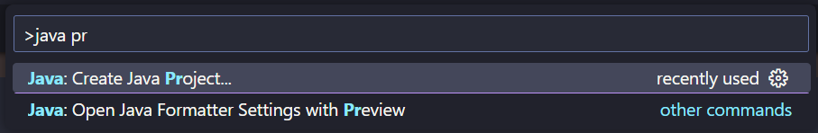
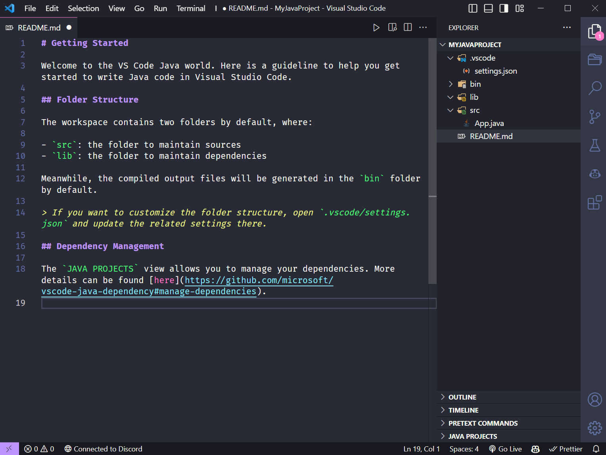
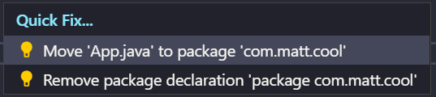
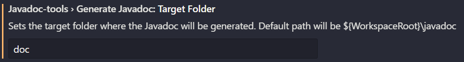
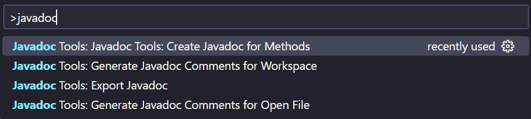
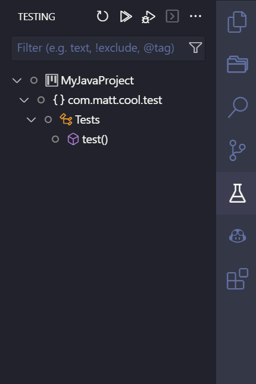

# Using Java with VSCode

The people are SICK of our Eclipse overlords. This is a guide to using VSCode for Java development.

## Table of Contents

- [Required Extensions](#required-extensions)
  - [Java Extension Pack](#java-extension-pack)
  - [Getter and Setter Generator](#getter-and-setter-generator)
  - [Javadoc Tools](#javadoc-tools)
- [Creating a Project](#creating-a-project)
- [Navigating a Project](#navigating-a-project)
  - [Fixing the Package Structure](#fixing-the-package-structure)
  - [Creating a Class](#creating-a-class)
  - [Getters and Setters Shortcut](#getters-and-setters-shortcut)
- [Generating JavaDocs](#generating-javadocs)
  - [Configuring our JavaDocs Directory](#configuring-our-javadocs-directory)
  - [Generating JavaDoc Comments](#generating-javadoc-comments)
  - [Generating the Actual JavaDocs](#generating-the-actual-javadocs)
- [Testing and Creating Tests](#testing-and-creating-tests)
  - [Setting up Tests](#setting-up-tests)
  - [Creating Tests](#creating-tests)
  - [Running Tests](#running-tests)
- [Debugging](#debugging)

## Required Extensions

### [Java Extension Pack](https://marketplace.visualstudio.com/items?itemName=vscjava.vscode-java-pack)

> A schmack ton of handy extensions for Java development

### [Getter and Setter Generator](https://marketplace.visualstudio.com/items?itemName=afmicc.GetterAndSetterGenerator)

> Generates getters and setters for Java

### [Javadoc Tools](https://marketplace.visualstudio.com/items?itemName=madhavd1.javadoc-tools)

> Generates JavaDocs

## Creating a Project

Alright, let's get into the fun stuff. Let's create a project.

First, open up your command palette with `Ctrl+Shift+P` (or `Cmd+Shift+P` on Mac) and type in "Java Project". Select "Java: Create Java Project".



Next, you'll be asked to select your build tools. You don't care. Select "No build tools". You'll then be prompted to select a folder. This is the folder where your project **folder** will be created, not just the raw project files. Just keep that in mind, you won't have to make a new folder for your project.

Finally, you'll be asked to name your project. Name it whatever you want. Just make sure to use PascalCase and name it something smart, or I'll judge you.

## Navigating a Project



Nice, you've got a project. Let's run through what was generated for us. We've got a `bin` folder and a `lib` folder, a `.vscode` folder, and most importantly, a `src` folder. The `bin` and `lib` folders are for compiled code and libraries, respectively. The `.vscode` folder is for VSCode settings. The `src` folder is where all of our code will go. Important to note, there's no package structure in this project. Let's fix that.

### Fixing the Package Structure

Packages are traditionally the companies domain name reversed, so let's stick with something like that. My name's "Cool Matt", so I'll make my package com.matt.cool. Let's do that. The quickest way to do this is to set our package in our `App.java` file. Open up `App.java` and change the package to `com.matt.cool`. Now we can hover over the `App` class and click "Move `App.java` to package 'com.matt.cool'".



Packages are basically folders, so you're also able to do this by making a handful of folders and naming them as such. This is good to know when we want to follow a MVC pattern.

Cool. From here, let's run our "Hello World" program. There's a little arrow in the top right corner of our `App.java` file. Click that and select "Run Java" from the dropdown. You should see a little terminal pop up and say "Hello World". If you have any other extensions installed that utilize the run button, they don't work. Trust me. I've tried.

### Creating a Class

There are two ways to do this:

1. Right click on the `src` folder, "New File", and name it `MyClass.java`. Easy.
2. Open up your command palette with `Ctrl+Shift+P` (or `Cmd+Shift+P` on Mac) and type in "Java Class". Select "Java: Create New Class". Enter a name for your class and go from there.

I prefer the first method, but the second method is good to know.

### Getters and Setters Shortcut

If you're like me, you're lazy. You don't want to type out getters and setters. Here's a shortcut using the [Getter and Setter Generator](https://marketplace.visualstudio.com/items?itemName=afmicc.GetterAndSetterGenerator) extension.

1. Highlight the variable(s) you want to generate getters and setters for.
2. Open up your command palette with `Ctrl+Shift+P` (or `Cmd+Shift+P` on Mac) and type in "Get". Select "Generate Get and Set Methods".
3. Cut those methods that it just generated and paste them **under** your constructor, you monster.

## Generating JavaDocs

### Configuring our JavaDocs Directory

Pop open the command palette and type in "User Settings". Select "Preferences: Open User Settings". You'll need to change the Target Folder to `doc`. Should look a little like this.



### Generating JavaDoc Comments



Command palette once again, this time type in "JavaDoc". You'll be prompted with a few options. Any of the "Generate" options are fine, but are a bit glitchy.

### Generating the Actual JavaDocs

Command palette again, "JavaDoc" again, this time we'll be using "Export JavaDoc". This will generate the actual JavaDocs.

**THIS WILL NOT WORK IF YOUR CODE IS NOT IN A PACKAGE!** This took me WEEKS to figure out. I'm not even kidding. I was so frustrated. I was about to give up on VSCode. I was about to give up on Java. I was about to give up on life. But I didn't. I kept going. And I'm glad I did. Because now I'm here, writing this guide for you. And you're here, reading this guide. And that's pretty cool. Peace and love, man. Peace and love.

## Testing and Creating Tests

### Setting up Tests

On the right side of your screen (or the left side, if you're lame), there should be a little icon that looks like a flask. This is where we'll be running our tests in a little bit. Click on it and select "Enable Java Tests". You'll be prompted to select a test runner. Select "JUnit Jupiter". Boom, tests are ready to go.

### Creating Tests

Make a folder called `test` in your `src` folder, preferably inside your master packages. Why test? Looks nice with my icon theme. Make a new file in that folder called `Test.java`. This is where we'll be writing our tests. Let's write a test for our `MyClass` class.

```java
package com.matt.cool.test;

// This is important.
import org.junit.jupiter.api.*;

// This is also important.
import com.matt.cool.MyClass;

public class Tests {
    private MyClass myClass = new MyClass("Matt");

    // This @Test annotation is important.
    @Test
    public void test() {
        // This is also important.
        Assertions.assertEquals("Matt", myClass.getName());
    }
}
```

### Running Tests



There's two ways to do this:

1. Click the little flask icon on the left side of your screen. From here, we can break down exactly what tests we want to run. We can run all tests, all tests in a file, or a specific test. We can also run tests in debug mode, which is pretty cool. We'll get into that later.
2. Pop open the command palette and type in "Java Test". Select "Java: Run Tests". This will run all tests in the project.

## Debugging

Hit `f5`. That's it. Add your breakpoints and you're good to go. You can also debug tests, which is pretty cool. Just click the little flask icon and select "Debug Test". You can also debug a specific test by clicking the little arrow next to the test name.
